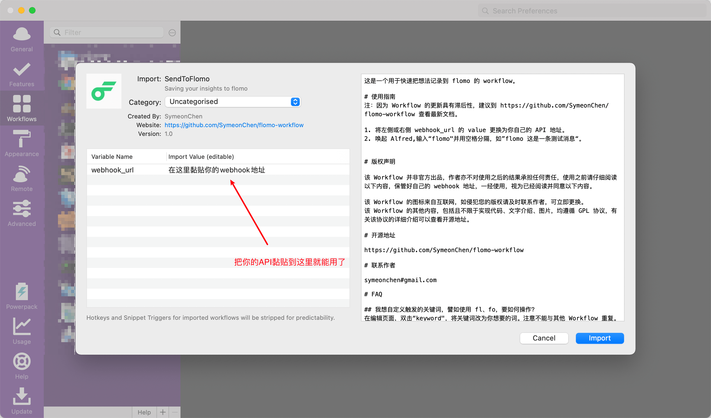
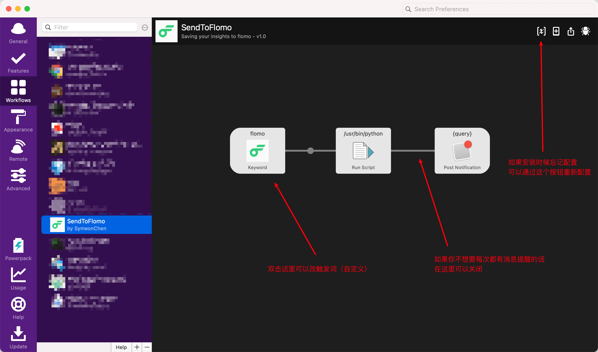
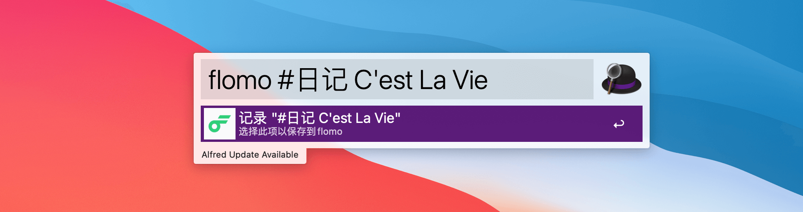

这是一个用于快速把想法记录到 flomo 的 workflow。

# 使用指南
1. 点击[此处](https://github.com/SymeonChen/flomo-workflow/releases/download/1.0.0/SendToFlomo.alfredworkflow)，下载 workflow
2. 双击打开，将左侧或右侧 webhook_url 的 value 更换为你自己的 API 地址。
3. 唤起 Alfred,输入“flomo"并用空格分隔，如”flomo 这是一条测试消息“。

# 版权声明

该 Workflow 并非官方出品，作者亦不对使用之后的结果承担任何责任，使用之前请仔细阅读以下内容，保管好自己的 webhook 地址，一经使用，视为已经阅读并同意以下内容。

该 Workflow 的图标来自互联网，如侵犯您的版权请及时联系作者，可立即更换。
该 Workflow 的其他内容，包括且不限于实现代码、文字介绍、图片，均遵循 GPL 协议，有关该协议的详细介绍可以查看开源地址。

# 开源地址

https://github.com/SymeonChen/flomo-workflow

# 联系作者

symeonchen#gmail.com

# FAQ

## 我想自定义触发的关键词，譬如使用 fl、fo，要如何操作？
在编辑页面，双击“keyword"，将关键词改为你想要的词。注意不能与其他 Workflow 重复。

## 为什么我的 Alfred 无法使用 Workflow？
请检查是否已经激活该功能，可参考 https://www.alfredapp.com/powerpack/

## 为什么我没有 webhook_url/API 地址？
请检查是否开通了该功能，可参考 https://flomoapp.com

## 我可以把 Workflow 分享给朋友吗？
无论是分享开源地址下载的 Workflow，或是导出你自己的 Workflow，请务必提前检查是否已经将你的 webhook 地址清除。
